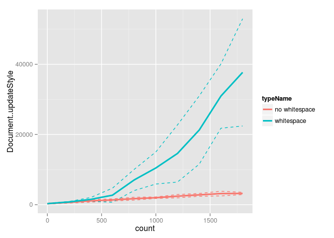
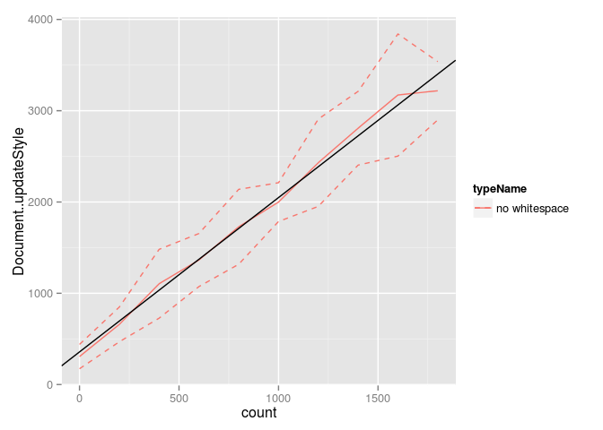
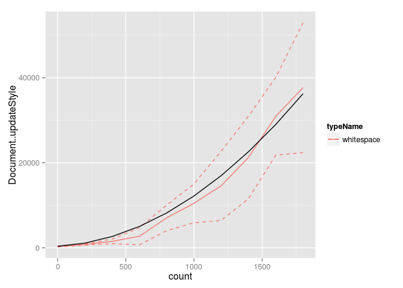

Comparison of single selectors ".a .c", ".b ~ .c", and ".c" matching against variable number of element subtrees:

    

      

      

      

      

    

Three properties are set in a single rule:

    %SEL {
      background-color: red;
      width: 100px;
      height: 100px;
    }

Graphs contain 630 samples.

  

As above, but without whitespace between divs (to avoid O(N^2) style). Graphs contain 150 samples.

  

Looking at just whitespace. Graphs contain 180 samples.

  

Without text nodes, the cost of updateStyle is linear, with an intercept of 296.2808081 and a slope of 1.7324411.

Introducing whitespace gives a cost that we assume fits a quadratic with 0 intercept, a constrained positive count term of 0, and a count^2 term of 0.0098904.

