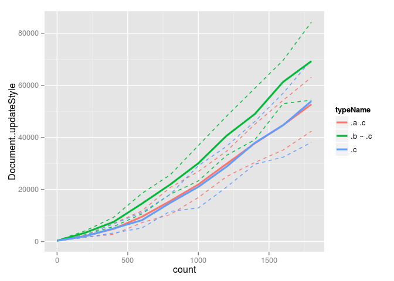
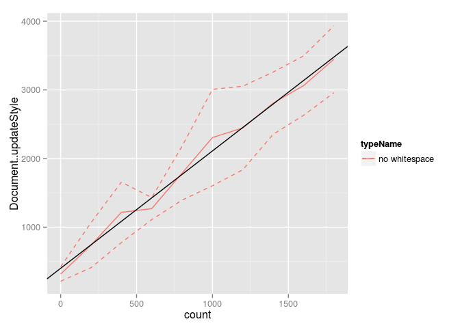
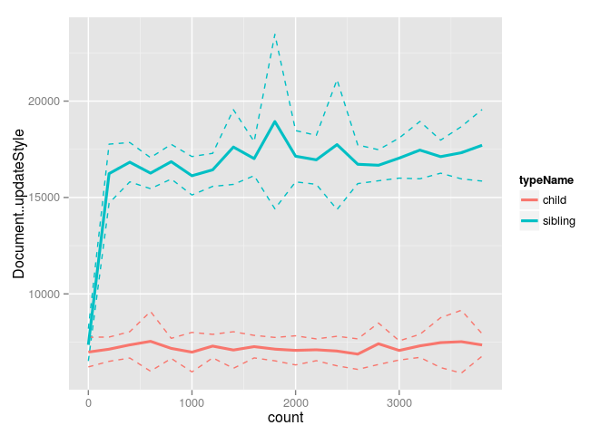
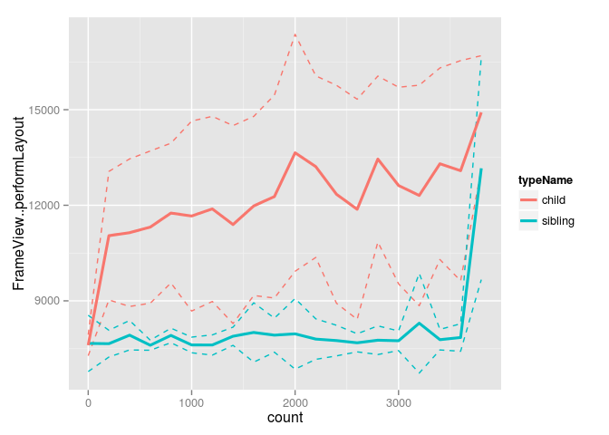
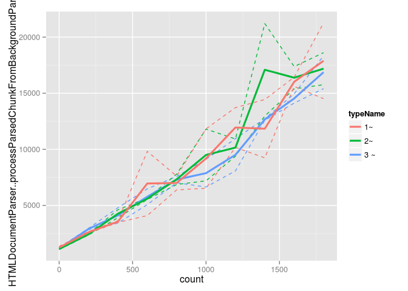
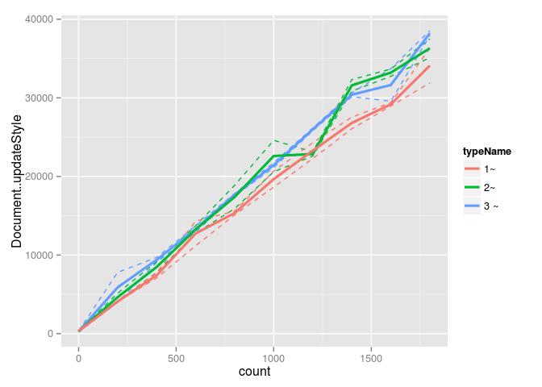
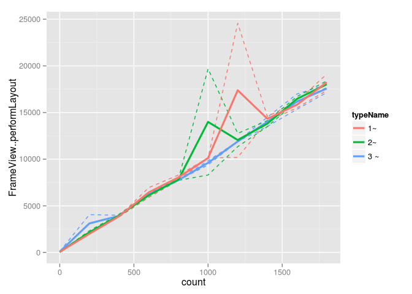
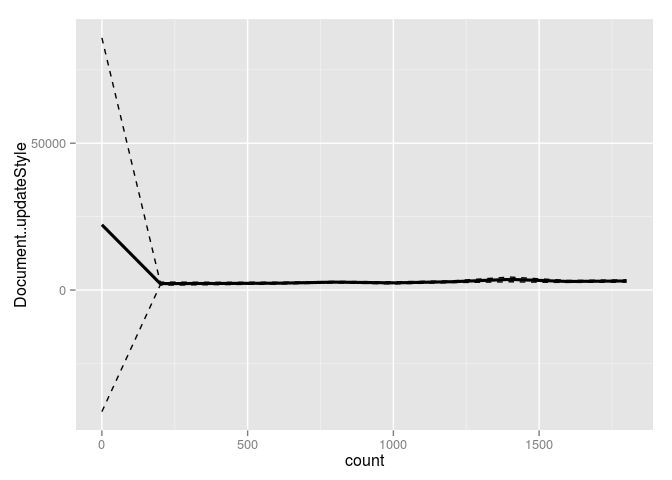
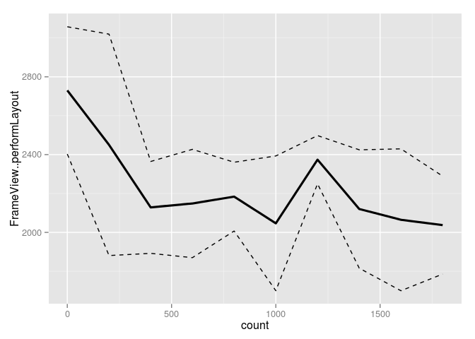

Comparison of single selectors ".a .c", ".b ~ .c", and ".c" matching against variable number of element subtrees:

    

      

      

      

      

    

Three properties are set in a single rule:

    %SEL {
      background-color: red;
      width: 100px;
      height: 100px;
    }

Graphs contain 630 samples.

  

As above, but without whitespace between divs (to avoid O(N^2) style). Graphs contain 150 samples.

  

Looking at just whitespace. Graphs contain 420 samples.

  

Without text nodes, the cost of updateStyle is linear, with an intercept of 357.1350649 and a slope of 1.6909928.

Introducing whitespace gives a cost that we assume fits a quadratic with 0 intercept, and constrained positive parameters of 0, 0.0101422.

No style at all (with and without whitespace). Graphs contain 460 samples.

  

styleTest3

  

styleTest4

  

The same repeated rule, applying to 1000 elements. Graphs contain 100 samples.

  

The same repeated rule with a different selector for each rule. One version applies to 1000 elements. Graphs contain 200 samples.

  

The same repeated rule with a different selector for each rule. Each rule applies to a single element. Graphs contain 20 samples.

  
