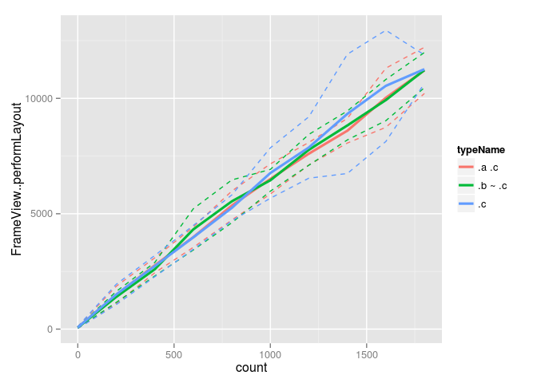

Comparison of single selectors ".a .c", ".b ~ .c", and ".c" matching against variable number of element subtrees:

    

      

      

      

      

    

Three properties are set in a single rule:

    %SEL {
      background-color: red;
      width: 100px;
      height: 100px;
    }

Graphs contain 630 samples.

  
